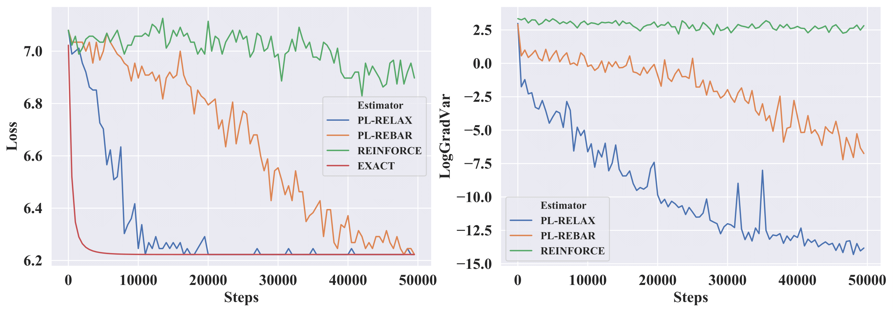

# Low-variance Black-box Gradient Estimates for the Plackett-Luce Distribution

This repo contains code for our paper [Low-variance Black-box Gradient Estimates for the Plackett-Luce Distribution](https://arxiv.org/abs/1911.10036).

__Abstract__

Learning models with discrete latent variables using stochastic gradient descent remains a challenge due to the high variance of gradients. Modern variance reduction techniques mostly consider categorical distributions and have limited applicability when the number of possible outcomes becomes large. In this work, we consider models with latent permutations and propose control variates for the Plackett-Luce distribution. In particular, the control variates allow us to optimize black-box functions over permutations using stochastic gradient descent. To illustrate the approach, we consider a variety of causal structure learning tasks for continuous and discrete data. We show that for differentiable functions, our method outperforms competitive relaxation-based optimization methods and is also applicable to non-differentiable score functions.

# Citation

```
Coming soon
```

# Toy Experiment

Prepare environment (maybe you'll need to change `cudatoolkit` version in `toy_env.yml` or even use `cpuonly` version of PyTorch):

```
conda env create -f toy_env.yml
conda activate toy_env
```

Run `toy_experiment.py`:

```
python toy_experiment.py --estimator exact
python toy_experiment.py --estimator reinforce
python toy_experiment.py --estimator rebar
python toy_experiment.py --estimator relax
```

Plot figure using `plot_toy.ipynb`



Results were obtained using `cpu`. Quantitative results for `cuda` may vary slighlty due to randomness in `cuda` kernels, but qualitative results remain the same.
